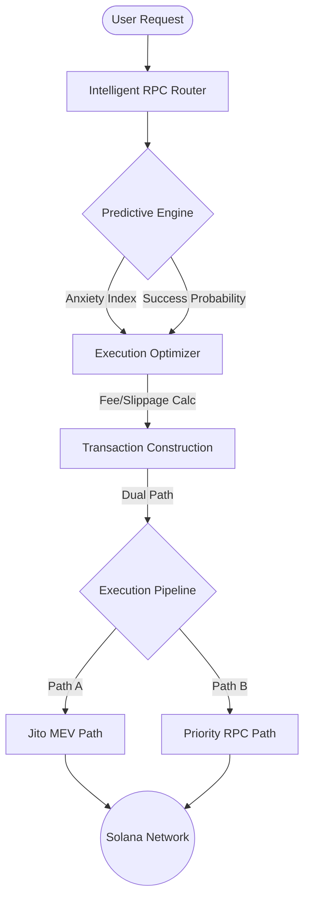

# <p align="center"></p>
# <p align="center">Belay Protocol & SDK</p>

<p align="center">
  <strong>Advanced AI-Driven Trading Infrastructure for the Solana Ecosystem</strong>
</p>

<p align="center">
  
  
  
</p>

---

## 🛠 Project Overview

**Belay Protocol** is a high-performance trading infrastructure designed to provide institutional-grade execution capabilities to retail traders on Solana. Unlike standard interfaces, Belay integrates deep-learning predictors and advanced network heuristics to ensure transaction success even during periods of extreme network congestion.

## 🚀 Key Functional Modules

### 1. 🧠 Intelligent Market Predictors
- **Market Anxiety Index**: Real-time sentiment analysis using volatility and order flow data to adjust execution parameters.
- **ML Success Classifier**: A trained model that predicts the probability of transaction success based on current network state (TPS, Slot Drift, and Median Fees).
- **Dynamic Priority Models**: Automated Jito and Priority Fee estimation to minimize costs while maintaining sub-second execution.

### 2. ⚡ Robust Transaction Pipeline
- **Dual-Path Routing**: Automatic fallback between standard RPC nodes and specialized MEV-protected paths (Jito Bundles).
- **Slippage Optimizer**: Adaptive slippage calculations based on pool depth and real-time price volatility.
- **Adaptive Retry Engine**: Smart exponential backoff logic that avoids RPC rate limits while capturing fleeting market opportunities.

### 3. 🌐 Intelligent RPC Router
- **Multi-Node Load Balancing**: Distributes requests across a cluster of RPC providers (Helius, Triton, Quicknode) based on latency and health.
- **Health Monitoring**: Real-time tracking of slot height and node synchronization.

---

## 🏗 Technical Architecture



---

## 📊 Performance & Data Scripts

The project includes a comprehensive suite of data collection and training scripts located in `/scripts`:

- `collectDataML.ts`: Real-time data harvester for network performance metrics.
- `trainPriorityFeeML.py`: Gradient boosting models for fee prediction.
- `labelFailuresAdvanced.ts`: Synthetic labeling system for training "anti-failure" models.

---

## 📦 Project Structure

```text
├── app/               # Next.js Terminal Dashboard
├── BELAY_GITHUB_ASSETS/ # GitHub Branding & Documentation
├── extension/         # Browser Extension Source
├── lib/solana/        # Core Protocol Logic (Routing, ML, Txs)
├── models/            # Pre-trained ML weights
├── public/            # Static Assets
└── scripts/           # Training & Data Collection Pipeline
```

---

## 🛠 Tech Stack

- **Core**: TypeScript, Node.js
- **Blockchain**: Solana Web3.js, @solana/wallet-adapter
- **AI/ML**: Python (Scikit-learn, XGBoost), TensorFlow
- **Interface**: React, Next.js, Framer Motion, Tailwind CSS

---

<p align="center">
  <i>Developed for the next generation of Solana DeFi.</i>
</p>
